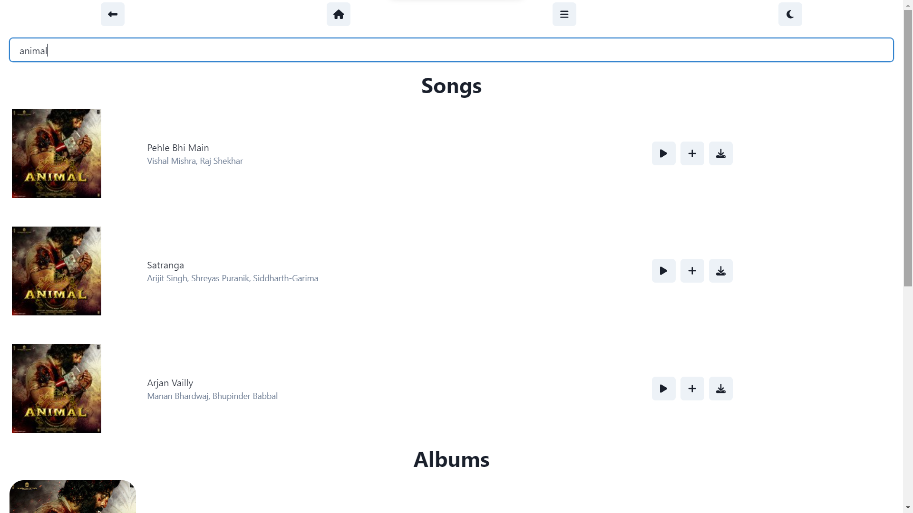
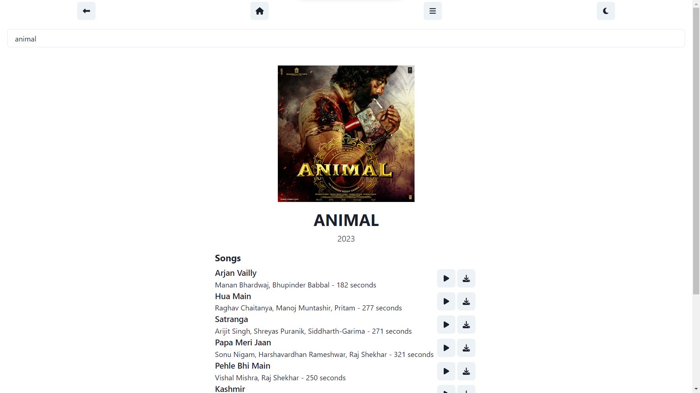
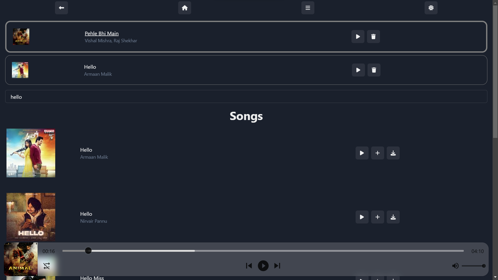
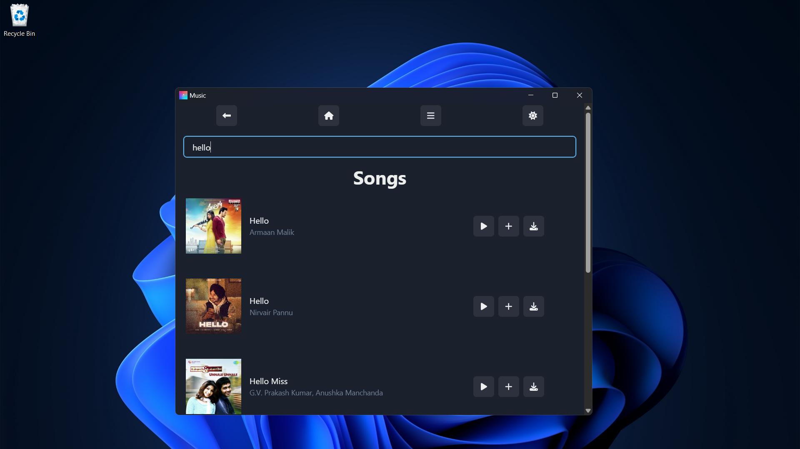

# An application to play and download music

## install dependencies
```
yarn install
```

## run dev server
```
yarn dev
```

## build tauri application (currently only windows is supported)

```
yarn tauri build
```

## Screenshots
### home

### search

### albums

### player, playlist, dark mode and more 

### standalone application too 


## Features

- Scrapes music from JioSaavn
- Can search songs and albums
- Ability to add to playlist
- Download songs in 150kbps(High Quality)

## TODO

- Export and save playlist
- Reccomendation system
- Authentication System

## What I learnt

- Application -> Middleware -> Server ( Architecture )
- Web Scraping

## Built with

- Frontend using [Next.js](https://nextjs.org)
- UI using [tailwindcss](https://tailwindcss.com)
- Deployed on [Vercel](https://vercel.com)
- Scraping [Jiosaavn](jiosaavn.com)
